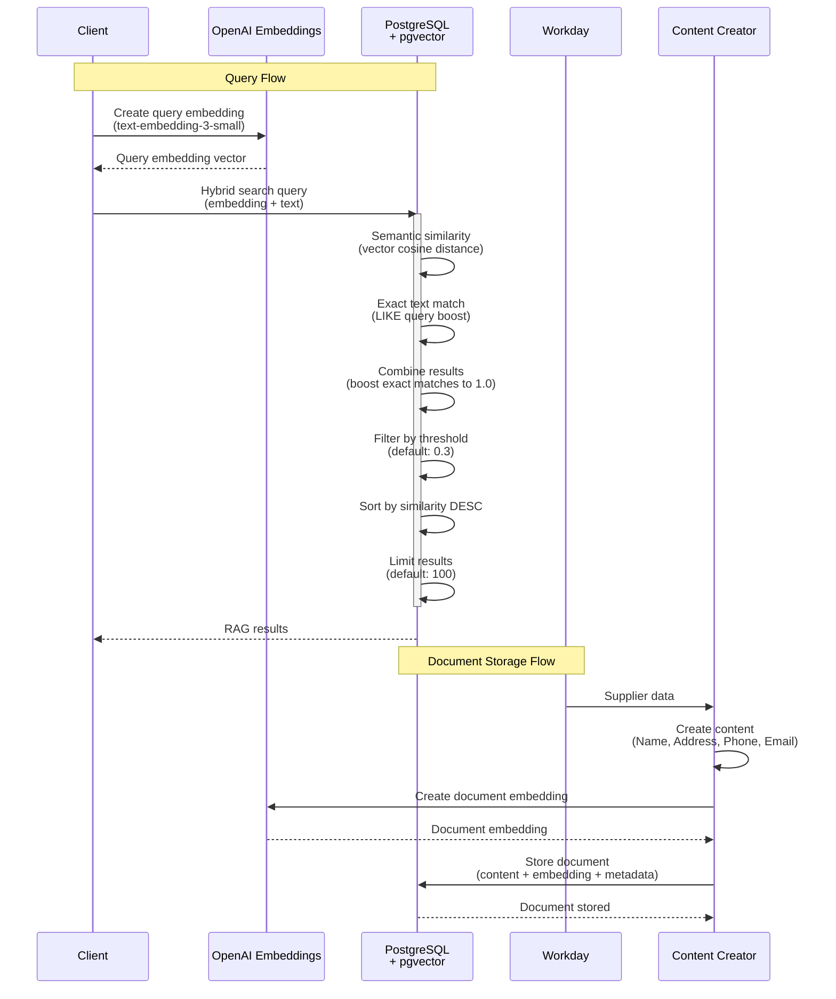
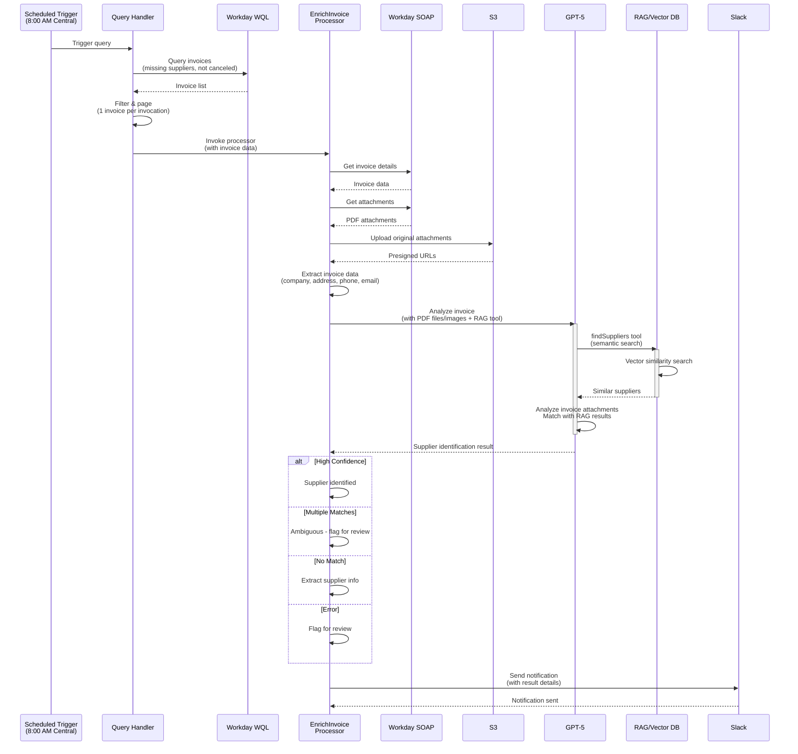
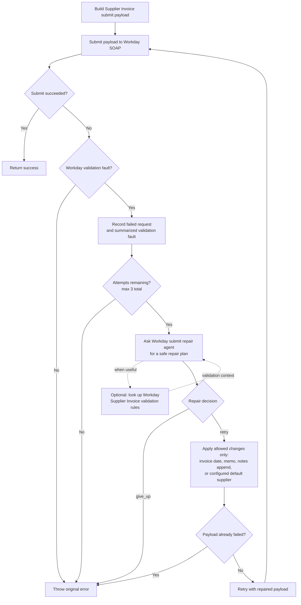
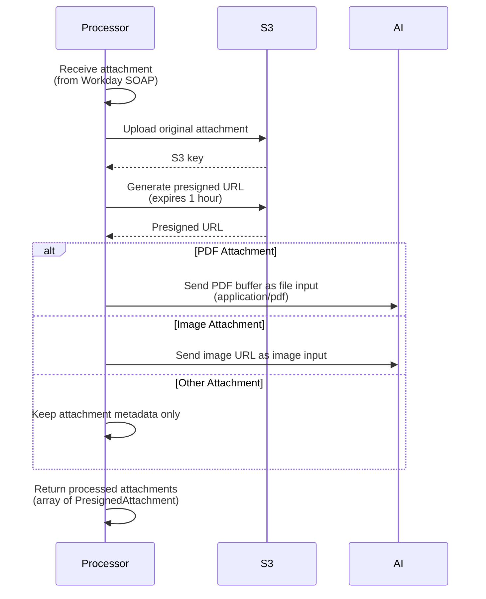
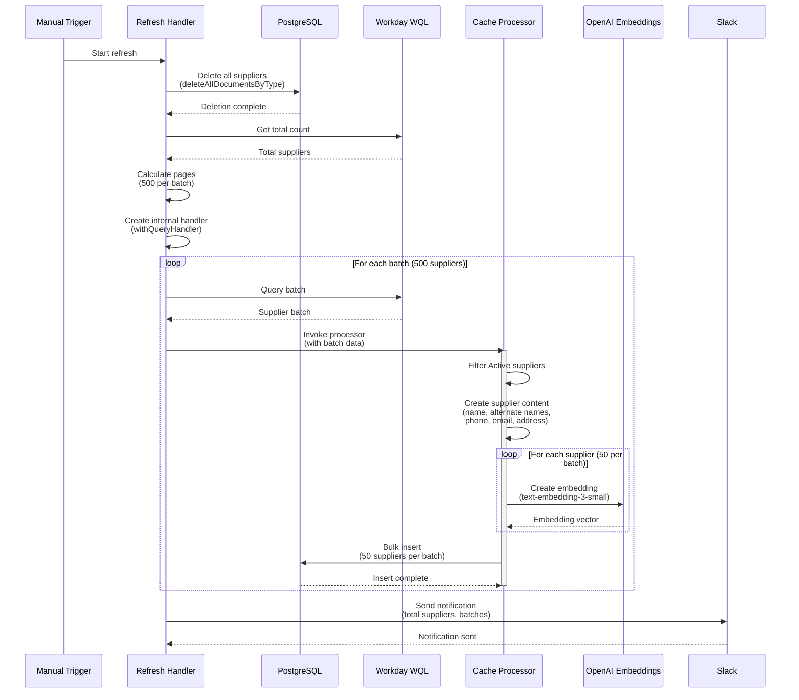
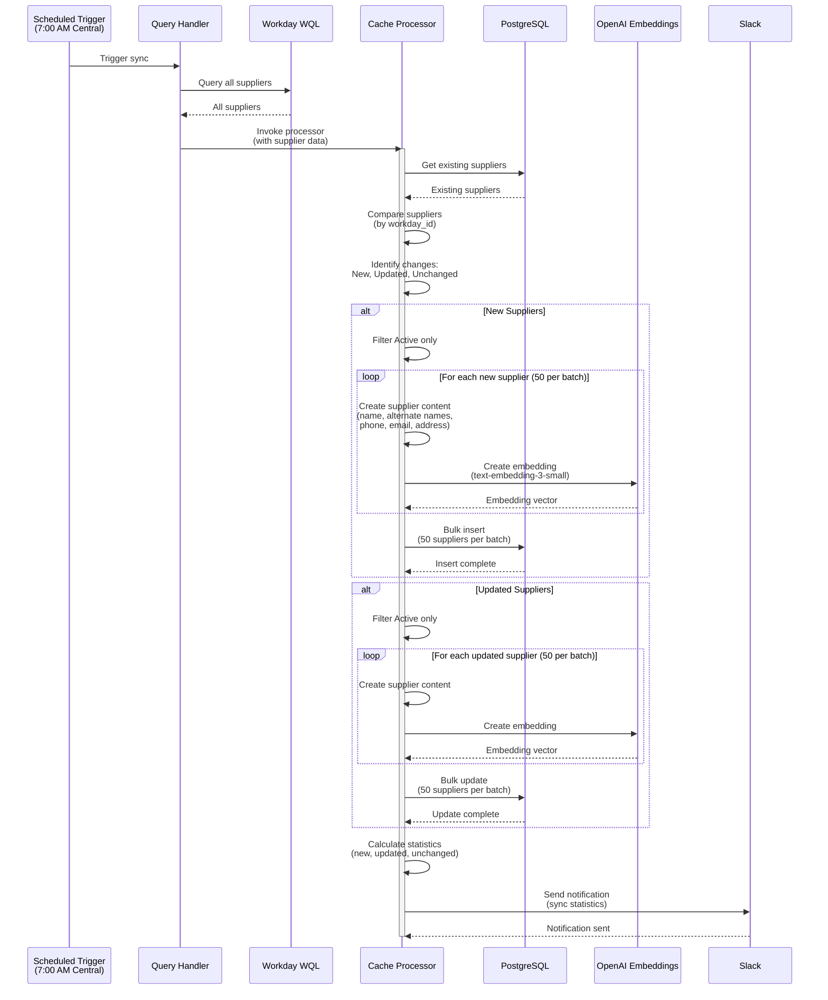

# Finance Agent 🏦

> **AI-Powered Finance Automation for Workday**  
> Serverless system for intelligent invoice processing and supplier management

[](https://www.typescriptlang.org/)
[](https://aws.amazon.com/lambda/)
[](https://nodejs.org/)
[](https://openai.com/)

## 🎯 Overview

The Finance Agent automates financial data processing in Workday by intelligently identifying suppliers for invoices. It uses AI to analyze invoice content, matches suppliers using semantic search, and enriches financial records automatically.

### Key Features

- 🤖 **AI-Powered Supplier Identification** - Automatically matches invoices with suppliers
- 📊 **Intelligent Data Processing** - Processes large datasets efficiently with modern handler architecture
- 🔄 **Event-Driven Architecture** - Scalable serverless design with query/processor separation
- 🔍 **Document Processing** - Handles PDF attachments and OCR data
- 📱 **Real-time Notifications** - Slack alerts for processing status
- 🧠 **RAG Integration** - Retrieval-Augmented Generation for intelligent supplier matching
- ⚡ **Self-Contained Operations** - Refresh operations use internal handlers for better reliability

### Recent Improvements

- **Modern Handler Architecture**: Separated query execution from data processing for better maintainability
- **Intelligent Pagination**: Configurable page sizes for efficient large dataset processing
- **Enhanced Test Coverage**: Focused Jest coverage for RAG, invoice enrichment, and Workday integration
- **Self-Contained Refresh**: Refresh operations no longer depend on external Lambda invocations
- **RAG Integration**: Added semantic search capabilities with OpenAI embeddings

## 🏗️ Architecture

The system runs on AWS Lambda with a modern handler architecture that separates query execution from data processing. It uses multiple Workday APIs for data access and includes intelligent pagination for large datasets.

### System Components


### Workday API Usage

**WQL (Workday Query Language)**

- Queries supplier master data and invoices
- Used for bulk data retrieval and filtering
- Scheduled daily for supplier sync and invoice discovery

**SOAP API**

- Retrieves detailed invoice information with PDF attachments
- Provides structured data exchange for invoice processing
- Enables access to invoice documents and metadata

### Handler Architecture

The system uses a modern handler pattern that separates concerns:

- **Query Handlers**: Execute Workday queries and handle pagination
- **Processor Handlers**: Process data with AI and update databases
- **Intelligent Pagination**: Handles large datasets efficiently with configurable page sizes
- **Self-Contained Operations**: Refresh operations use internal query handlers instead of external Lambda invocations

### Daily Processing

1. **7:00 AM Central - Supplier Sync**: Updates supplier database with latest Workday data
2. **8:00 AM Central - Invoice Processing**: Finds invoices missing suppliers and processes them
3. **AI Analysis**: For each invoice, AI analyzes content and matches suppliers
4. **Notifications**: Slack alerts for processing results and any issues

### Manual Operations

- **Refresh Suppliers**: Full rebuild of supplier database with intelligent pagination
  - Deletes all existing suppliers
  - Uses internal query handler with 500-record batches
  - Self-contained operation with no external Lambda dependencies
  - Includes alternate names and updated metadata structure

## 📁 Project Structure

```
src/
├── cache_suppliers.ts              # Daily supplier data sync (handler + processor)
├── refresh_suppliers.ts            # Full supplier database rebuild
├── enrich_invoice.ts      # Invoice processing with AI (handler + processor)
├── query_documents.ts              # Document search endpoint
├── lib/
│   ├── handlers.ts                 # Handler architecture (withQueryHandler, withProcessorHandler)
│   ├── ai.ts                       # AI integration
│   ├── database.ts                 # PostgreSQL database
│   ├── rag.ts                      # RAG and embedding functionality
│   ├── slack.ts                    # Slack notifications
│   ├── workday.ts                  # Workday API client
│   └── types.ts                    # Type definitions
└── __tests__/                      # Test suite
```

## 🔧 System Architecture

### Handler Architecture

- **withQueryHandler**: Executes Workday queries with intelligent pagination
- **withProcessorHandler**: Processes data with AI and updates databases
- **Separation of Concerns**: Clean separation between query execution and data processing
- **Configurable Pagination**: Supports both bulk processing and paginated operations
- **Self-Contained Operations**: Refresh operations use internal handlers

### Vector Database

- PostgreSQL with pgvector for semantic supplier search
- Stores supplier embeddings for intelligent matching
- Enables fast similarity search across supplier data
- Incremental sync keeps data current

### Attachment Processing

- Downloads invoice PDFs from Workday
- Saves original attachments to S3 for audit/debug access
- Sends PDF attachments to the AI model as `application/pdf` file inputs
- Sends image attachments to the AI model as image inputs
- Generates presigned URLs for document access

### RAG (Retrieval-Augmented Generation)

- OpenAI embeddings for semantic search
- Hybrid search combining semantic similarity with exact text matching
- Configurable similarity thresholds and result limits
- AI tools for supplier identification

### Workday Integration

- **WQL**: Bulk data queries for suppliers and invoices
- **SOAP API**: Detailed invoice information and PDF attachments
- OAuth authentication with refresh tokens
- Handles large datasets with intelligent pagination

### AI Processing

- OpenAI GPT-5 for supplier identification
- Structured responses with confidence scoring
- Analyzes invoice content and metadata
- Integrates with vector database for context

## 🧠 AI-Powered Features

### Supplier Identification

AI analyzes invoice content and matches suppliers by examining metadata, OCR data, and company information using semantic search.

### Processing Results

- **High Confidence**: Automatic supplier assignment
- **Ambiguous**: Multiple candidates - flagged for review
- **Not Found**: No suitable match - requires manual processing
- **Error**: Processing failed - retry or manual intervention

## 🔧 Development

### Prerequisites

- Node.js 20+
- Workday API access
- OpenAI API key

### Local Development

```bash
git clone <repository-url>
cd finance-agent
npm install
npm run build
npm test
```

### Configuration

Set up parameters in AWS Systems Manager Parameter Store for Workday credentials, OpenAI API key, and Slack webhook URL.

## 🧪 Testing

```bash
npm test                    # Run all tests
npm run test:coverage      # Run with coverage
```

### Test Coverage

- Jest coverage includes:
  - Handler architecture (`handlers.ts`: 97.67%)
  - RAG functionality (`rag.ts`: 86%)
  - Supplier refresh (`refresh_suppliers.ts`: 100%)
  - Core business logic and Workday API interactions

Tests cover all core functions including supplier sync, invoice processing, AI integration, handler architecture, and Workday API interactions.

## 🚀 Deployment

Deployment is automated via CircleCI:

- **Development**: Deploys on `development` branch
- **Production**: Deploys on `main` branch

### Infrastructure

- AWS Lambda functions with VPC integration
- Aurora PostgreSQL database with pgvector extension
- S3 bucket for PDF attachments
- CloudWatch for logging and monitoring
- Modern handler architecture with query/processor separation

## 📈 Monitoring

- **CloudWatch**: Function logs and metrics
- **Slack**: Real-time notifications to #notify-finance-agent-dev
- **Error Tracking**: Detailed error context and processing statistics

## 🔒 Security

- Workday OAuth authentication
- AWS IAM with least privilege access
- Encrypted secrets in Parameter Store
- VPC network isolation
- Data encryption at rest and in transit

## Open Source & Legal Readiness

> **Audience:** Legal review, security review, and downstream documentation agents deciding whether and how to open source this repository.
>
> **Status:** Pre-release. Intended license and contribution model are decided in principle; several third-party and abstraction items remain open (see [Open questions & follow-ups](#open-questions--follow-ups)).

### 1. Executive summary

**Finance Agent** (working title — **public name will be generic** and will not include "PGA" or "Workday" in the product name; descriptive positioning such as *a finance agent for Workday customers*) is a serverless TypeScript application that integrates with **Workday** (WQL, REST, SOAP) to automate supplier-invoice enrichment using **retrieval-augmented generation (RAG)** and **large language models (LLMs)**.

**Governance:** PGA of America maintains the repository initially. **Distribution:** PGA and its partners will **not** host a shared production instance; each adopter deploys to their own cloud account. The goal is **true open source** for the broader **Workday customer ecosystem**, including code and financial support from other enterprises (e.g. soft interest from PGA Tour as contributor and/or funder — structure subject to legal review).

The system can **read and write** Workday supplier invoice data, cache supplier master data in PostgreSQL (pgvector), store invoice attachments in S3, and optionally notify operators via pluggable channels (Slack today; abstracted in OSS phase).

### 2. Rights & license

| Item | Status |
|------|--------|
| **Copyright holder** | PGA of America (retains all IP rights in project code, documentation, and prompts unless otherwise assigned via contribution agreements) |
| **Intended license** | [GNU Affero General Public License v3.0 (AGPL-3.0)](https://www.gnu.org/licenses/agpl-3.0.html) |
| **LICENSE file in repo** | TODO — add `LICENSE` with AGPL-3.0 full text after legal sign-off |
| **Patents / trade secrets** | None asserted for open-source release; no known trade-secret blockers in application logic |

**AGPL note:** PGA of America and its partners will **not** operate a hosted multi-tenant service for this project. **Each operator** who deploys the software (e.g. AWS Lambda behind their network) is responsible for AGPL-3.0 compliance for *their* deployment, including source-offer obligations for network users if applicable. AGPL does not apply to PGA merely because PGA is the copyright holder of the upstream repository.

### 3. Trademark & naming

The **PGA of America** name, logos, and other brand marks remain the property of the PGA of America. The **open-source product name** will be generic (no "PGA" or "Workday" in the name). Use of PGA marks in forks, marketing, or conference materials requires separate authorization.

Documentation and READMEs may **highlight partners** who offer optional integrations (for example, an identity provider for agentic SSO) or professional services for adopters. Such mentions must:

- Be factual (e.g. "configurable Okta integration when enabled in deployment")
- Not imply PGA endorsement of the partner's full product line unless contracted
- Link to the partner's own terms and trademarks

**TODO:** Add `TRADEMARK.md` covering PGA marks, neutral project naming, and partner-mention guidelines.

### 4. Community, contributions & CLA

| Item | Direction |
|------|-----------|
| **Community goal** | True open community: other Workday customers may contribute code, run the stack in their tenants, and optionally support the project financially |
| **Early adopters** | Soft commitment from PGA Tour to use and/or contribute |
| **Contribution agreement** | **Corporate and individual CLA** required (not DCO-only) |
| **Funding** | PGA Tour may contribute code and/or fund development payable to PGA of America — **legal review TODO** |

**TODO:** Select CLA platform (e.g. EasyCLA, CLA Assistant), publish corporate + individual agreements, and wire GitHub status checks.

### 5. Data classification & LLM disclosure

**Supplier invoice attachments** (PDFs, images, and related metadata retrieved from Workday) may contain **PII, confidential business information, payment details, and other regulated data**. When an LLM provider is configured (e.g. OpenAI), **attachment content and derived invoice context are transmitted to that third party** subject to the operator’s agreement with the provider.

Operators must:

- Classify data before enabling LLM features
- Configure provider terms (enterprise DPA, zero retention, no training, region, subprocessors) appropriate to their jurisdiction and industry
- Restrict S3, database, and log retention to policy
- Treat automated Workday **write-back** (supplier assignment, memo/date repair, default supplier fallback) as **high-impact**

**Deploy-time configuration:** Product and security behavior (LLM enablement, invoice modification, notifications, authentication/SSO, human-in-the-loop requirements) are intended to be controlled via **feature flags and environment configuration** when an operator deploys the stack. Safe defaults and documentation are an OSS-phase deliverable; this repository does not prescribe a single PGA production policy.

This repository documents behavior; **it does not provide compliance certification** for any tenant or cloud account.

### 6. Third-party & vendor dependencies

| Dependency | Role | Open-source readiness |
|------------|------|------------------------|
| **Workday** (WQL, REST, SOAP) | System of record; optional invoice mutation | **TODO:** Legal review of Workday API/developer terms for publishing integration patterns |
| **Workday WSDLs** (`src/soap/*.wsdl`, ~10 MB) | SOAP client generation / calls | Sourced from Workday’s publicly hosted Production API files ([Community index](https://community.workday.com/sites/default/files/file-hosting/productionapi/index.html)). **TODO:** Legal confirm bundling + integration code publication under Workday API terms |
| **OpenAI** (embeddings + chat) | Supplier matching and submit-repair agents | **TODO (OSS phase):** Abstract behind a pluggable LLM interface; document required provider policies |
| **Slack** | Operational notifications | **TODO (OSS phase):** Abstract behind a pluggable notification interface |
| **`@pga/logger`, `@pga/lambda-env`** | Logging and env loading | Published on npm under **ISC**; **TODO (OSS phase):** Replace with neutral packages or document as optional PGA reference implementations |
| **AWS** (Lambda, RDS, S3, DynamoDB, SSM) | Runtime and secrets | Standard SDK licenses; deployment is operator-specific |

**TODO:** Add `NOTICE` / third-party license aggregation (e.g. `npm` license scan in CI) once `package-lock.json` policy is settled.

### 7. Open-source roadmap (abstraction phase)

Planned **OSS phase** work before or alongside public launch:

- [ ] **LLM abstraction** — provider-agnostic interface (OpenAI as reference implementation)
- [ ] **Notifications abstraction** — Slack as reference implementation
- [ ] **Logging / env abstraction** — remove hard dependency on `@pga/*` packages or publish them under AGPL-3.0
- [ ] **Tenant-neutral configuration** — remove or parameterize PGA-specific defaults (Workday tenant names, default supplier WIDs, internal SSM path names, internal Slack channels) in `template.yml`, CI, and docs
- [ ] **LICENSE + TRADEMARK + CONTRIBUTING** files
- [ ] **WSDL & Workday API** legal clearance (see §6)
- [ ] **Secret / history scan** before first public push

### 8. Technical risks (open-source product)

| Risk | Description | Mitigation direction |
|------|-------------|---------------------|
| **ERP mutation** | Code can submit supplier invoice updates and AI-driven repair retries to Workday | Feature flags (`INVOICE_MOD_ENABLED`), least-privilege ISU, human review for production |
| **LLM data egress** | Invoice PDFs and supplier PII may leave the operator’s boundary | Provider DPAs, disable LLM path, on-prem / private models when abstracted |
| **Misconfiguration** | Hardcoded or copied tenant IDs, WIDs, SSM ARNs | OSS phase parameterization; deployment guides |
| **Private npm packages** | `@pga/*` may block community builds | Abstraction phase |
| **WSDL / API terms** | Workday IP and developer terms | Public WSDL hosting noted; formal legal sign-off TODO |
| **AGPL compliance** | Each **operator** who exposes the app over a network must comply | PGA does not host; operator documentation TODO |
| **AI nondeterminism** | Wrong supplier or repair plan | Confidence thresholds, Slack alerts, validation-failure store |
| **Dependency audit** | No `package-lock.json` in tree at time of writing | Add lockfile + license CI |
| **Attack surface** | OAuth tokens, presigned S3 URLs, document query endpoints | Document security baseline; auth on HTTP APIs |

### 9. Disclaimers

**NO WARRANTY.** THE SOFTWARE IS PROVIDED “AS IS”, WITHOUT WARRANTY OF ANY KIND, EXPRESS OR IMPLIED, INCLUDING BUT NOT LIMITED TO THE WARRANTIES OF MERCHANTABILITY, FITNESS FOR A PARTICULAR PURPOSE, AND NONINFRINGEMENT.

**NO LIABILITY.** IN NO EVENT SHALL THE COPYRIGHT HOLDER OR CONTRIBUTORS BE LIABLE FOR ANY CLAIM, DAMAGES, OR OTHER LIABILITY ARISING FROM USE OF THIS SOFTWARE.

**NOT FINANCIAL, TAX, OR LEGAL ADVICE.** Operators are solely responsible for accounts payable controls, audit trails, and regulatory obligations in their jurisdiction.

**EXPORT CONTROL.** Status **unknown** — TODO for legal review whether finance/ERP integration code triggers export classification review.

### 10. Pre-release scans (for Legal)

A snapshot report from dependency, license, and secret scans is maintained at [`docs/legal-pre-release-scan.md`](docs/legal-pre-release-scan.md). Re-run before the first public push (especially **gitleaks on full git history**, which was not completed in the automated environment).

### 11. Agent documentation notes

When documenting or scoring this repository for open-source readiness, agents should:

1. Treat §§1–10 as the canonical legal/technical summary until separate policy docs exist.
2. Record blockers explicitly: Workday API terms, missing `LICENSE`, CLA tooling, scrub of org-specific config defaults.
3. Not mark “ready to publish” until OSS phase TODOs agreed with legal are complete or waived in writing.
4. Preserve the **LLM + attachment PII** warning and **self-hosted-only** distribution model in any derivative docs.

### Open questions & follow-ups

| ID | Topic | Owner | Status |
|----|-------|-------|--------|
| L-01 | Publish `LICENSE` (AGPL-3.0) | Legal | TODO |
| L-02 | `TRADEMARK.md` for PGA of America marks | Legal | TODO |
| L-03 | Corporate + individual CLA (vendor + enforcement) | Legal | TODO |
| L-04 | Workday WSDL + API terms (public Community hosting noted) | Legal | TODO — confirm |
| L-05 | PGA Tour funding / contribution structure | Legal | TODO — may be nixed |
| L-06 | OpenAI / LLM subprocessors and public documentation | Legal + Security | TODO (OSS phase abstraction) |
| L-07 | Export control screening | Legal | TODO — unknown |
| L-08 | Partner README mentions (integrations + services) disclaimer template | Legal | TODO |
| L-11 | Public **generic project name** + repo rename | Product + Legal | TODO |
| L-09 | `NOTICE` and dependency license CI | Engineering | TODO |
| L-10 | Remove PGA-specific deployment identifiers from public defaults | Engineering | TODO (OSS phase) |

**Questions still requiring PGA / Legal input:**

1. **PGA Tour funding:** Acceptable structure for payments to PGA of America vs. direct project sponsorship.
2. **Workday API terms:** Confirm publishing integration patterns (beyond publicly hosted WSDLs).
3. **Partner highlights:** Approved disclaimer for README “Partners & integrations” (e.g. Okta when SSO ships).
4. **Export control:** Trigger formal review yes/no.
5. **Public name / repo rename:** Final generic name and timing relative to `LICENSE` commit.
6. **NOTICE + lockfile:** Commit `package-lock.json` and generated `NOTICE` for AGPL distribution?

---

## 📄 License

Copyright © PGA of America. All rights reserved.

**Intended release license:** GNU Affero General Public License v3.0 (AGPL-3.0). The full license text will be added to `LICENSE` in the repository upon legal approval. Until then, this code is **not** licensed for public redistribution.

See [Open Source & Legal Readiness](#open-source--legal-readiness) for trademarks, data warnings, and release blockers.

## Process Flows

#### RAG Pipeline

The RAG (Retrieval-Augmented Generation) pipeline enables semantic search for supplier matching:



#### Enrich Invoices Process

The invoice enrichment process identifies missing suppliers using AI and RAG:



#### Workday Submit Retry Process

Supplier invoice updates go through a guarded retry loop before the final Workday SOAP result is returned. The retry process applies to invoice submit operations such as supplier updates and note-only verification updates.



Retry guardrails:

- Only Workday validation faults are eligible for repair; non-validation errors are rethrown immediately.
- The repair agent must inspect the latest failed request before deciding whether to retry.
- Repairs are intentionally narrow: invoice date, memo, appended notes, or switching to the configured default supplier when available.
- The loop tracks failed payload fingerprints and aborts if a repair would repeat a payload that already failed.
- The final validation fault is rethrown after the third failed submit attempt or when the repair agent chooses `give_up`.

#### Attachment Processing Pipeline

The attachment processing pipeline uploads the original Workday attachments for access/debugging and sends supported attachment content directly to the AI model:



#### Refresh Suppliers Process

The refresh process performs a full rebuild of the supplier database:



#### Cache Suppliers Process

The daily supplier sync process incrementally updates the supplier database:


