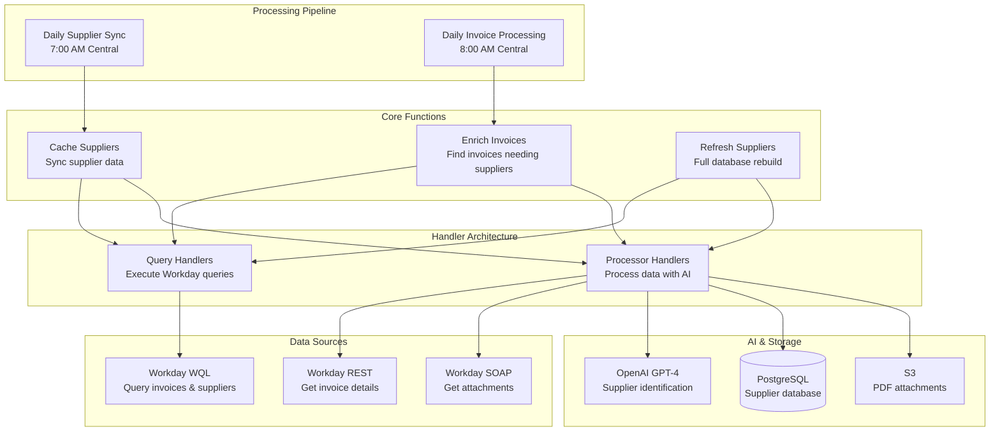

# Finance Agent 🏦

> **AI-Powered Finance Automation for Workday**  
> Serverless system for intelligent invoice processing and supplier management

[](https://www.typescriptlang.org/)
[](https://aws.amazon.com/lambda/)
[](https://nodejs.org/)
[](https://openai.com/)

## 🎯 Overview

The Finance Agent automates financial data processing in Workday by intelligently identifying suppliers for invoices. It uses AI to analyze invoice content, matches suppliers using semantic search, and enriches financial records automatically.

### Key Features

- 🤖 **AI-Powered Supplier Identification** - Automatically matches invoices with suppliers
- 📊 **Intelligent Data Processing** - Processes large datasets efficiently with modern handler architecture
- 🔄 **Event-Driven Architecture** - Scalable serverless design with query/processor separation
- 🔍 **Document Processing** - Handles PDF attachments and OCR data
- 📱 **Real-time Notifications** - Slack alerts for processing status
- 🧠 **RAG Integration** - Retrieval-Augmented Generation for intelligent supplier matching
- ⚡ **Self-Contained Operations** - Refresh operations use internal handlers for better reliability

### Recent Improvements

- **Modern Handler Architecture**: Separated query execution from data processing for better maintainability
- **Intelligent Pagination**: Configurable page sizes for efficient large dataset processing
- **Enhanced Test Coverage**: 88 tests with 74.72% coverage including comprehensive RAG and PDF testing
- **Self-Contained Refresh**: Refresh operations no longer depend on external Lambda invocations
- **RAG Integration**: Added semantic search capabilities with OpenAI embeddings

## 🏗️ Architecture

The system runs on AWS Lambda with a modern handler architecture that separates query execution from data processing. It uses multiple Workday APIs for data access and includes intelligent pagination for large datasets.

### System Components



### Workday API Usage

**WQL (Workday Query Language)**
- Queries supplier master data and invoices
- Used for bulk data retrieval and filtering
- Scheduled daily for supplier sync and invoice discovery

**SOAP API**
- Retrieves detailed invoice information with PDF attachments
- Provides structured data exchange for invoice processing
- Enables access to invoice documents and metadata

### Handler Architecture

The system uses a modern handler pattern that separates concerns:

- **Query Handlers**: Execute Workday queries and handle pagination
- **Processor Handlers**: Process data with AI and update databases
- **Intelligent Pagination**: Handles large datasets efficiently with configurable page sizes
- **Self-Contained Operations**: Refresh operations use internal query handlers instead of external Lambda invocations

### Daily Processing

1. **7:00 AM Central - Supplier Sync**: Updates supplier database with latest Workday data
2. **8:00 AM Central - Invoice Processing**: Finds invoices missing suppliers and processes them
3. **AI Analysis**: For each invoice, AI analyzes content and matches suppliers
4. **Notifications**: Slack alerts for processing results and any issues

### Manual Operations

- **Refresh Suppliers**: Full rebuild of supplier database with intelligent pagination
  - Deletes all existing suppliers
  - Uses internal query handler with 500-record batches
  - Self-contained operation with no external Lambda dependencies
  - Includes alternate names and updated metadata structure

## 📁 Project Structure

```
src/
├── cache_suppliers.ts              # Daily supplier data sync (handler + processor)
├── refresh_suppliers.ts            # Full supplier database rebuild
├── enrich_invoice_supplier.ts      # Invoice processing with AI (handler + processor)
├── query_documents.ts              # Document search endpoint
├── lib/
│   ├── handlers.ts                 # Handler architecture (withQueryHandler, withProcessorHandler)
│   ├── ai.ts                       # AI integration
│   ├── database.ts                 # PostgreSQL database
│   ├── pdf.ts                      # PDF processing utilities
│   ├── rag.ts                      # RAG and embedding functionality
│   ├── slack.ts                    # Slack notifications
│   ├── workday.ts                  # Workday API client
│   └── types.ts                    # Type definitions
└── __tests__/                      # Test suite (88 tests, 74.72% coverage)
```

## 🔧 System Architecture

### Handler Architecture
- **withQueryHandler**: Executes Workday queries with intelligent pagination
- **withProcessorHandler**: Processes data with AI and updates databases
- **Separation of Concerns**: Clean separation between query execution and data processing
- **Configurable Pagination**: Supports both bulk processing and paginated operations
- **Self-Contained Operations**: Refresh operations use internal handlers

### Vector Database
- PostgreSQL with pgvector for semantic supplier search
- Stores supplier embeddings for intelligent matching
- Enables fast similarity search across supplier data
- Incremental sync keeps data current

### PDF Processing
- Downloads invoice PDFs from Workday
- Splits multi-page PDFs into separate images using pdftocairo
- Uses vision models to extract text and data
- Generates presigned URLs for document access

### RAG (Retrieval-Augmented Generation)
- OpenAI embeddings for semantic search
- Hybrid search combining semantic similarity with exact text matching
- Configurable similarity thresholds and result limits
- AI tools for supplier identification

### Workday Integration
- **WQL**: Bulk data queries for suppliers and invoices
- **SOAP API**: Detailed invoice information and PDF attachments
- OAuth authentication with refresh tokens
- Handles large datasets with intelligent pagination

### AI Processing
- OpenAI GPT-4 for supplier identification
- Structured responses with confidence scoring
- Analyzes invoice content and metadata
- Integrates with vector database for context

## 🧠 AI-Powered Features

### Supplier Identification
AI analyzes invoice content and matches suppliers by examining metadata, OCR data, and company information using semantic search.

### Processing Results
- **High Confidence**: Automatic supplier assignment
- **Ambiguous**: Multiple candidates - flagged for review  
- **Not Found**: No suitable match - requires manual processing
- **Error**: Processing failed - retry or manual intervention

## 🔧 Development

### Prerequisites

- Node.js 20+
- Workday API access
- OpenAI API key

### Local Development

```bash
git clone <repository-url>
cd finance-agent
npm install
npm run build
npm test
```

### Configuration

Set up parameters in AWS Systems Manager Parameter Store for Workday credentials, OpenAI API key, and Slack webhook URL.

## 🧪 Testing

```bash
npm test                    # Run all tests (88 tests)
npm run test:coverage      # Run with coverage (74.72% overall)
```

### Test Coverage
- **88 tests passing** across 11 test suites
- **74.72% overall coverage** with comprehensive test coverage for:
  - Handler architecture (`handlers.ts`: 97.67%)
  - RAG functionality (`rag.ts`: 86%)
  - PDF processing (`pdf.ts`: 58.92%)
  - Supplier refresh (`refresh_suppliers.ts`: 100%)
  - Core business logic and Workday API interactions

Tests cover all core functions including supplier sync, invoice processing, AI integration, handler architecture, and Workday API interactions.

## 🚀 Deployment

Deployment is automated via CircleCI:
- **Development**: Deploys on `development` branch
- **Production**: Deploys on `main` branch

### Infrastructure
- AWS Lambda functions with VPC integration
- Aurora PostgreSQL database with pgvector extension
- S3 bucket for PDF attachments
- CloudWatch for logging and monitoring
- Modern handler architecture with query/processor separation

## 📈 Monitoring

- **CloudWatch**: Function logs and metrics
- **Slack**: Real-time notifications to #notify-finance-agent-dev
- **Error Tracking**: Detailed error context and processing statistics

## 🔒 Security

- Workday OAuth authentication
- AWS IAM with least privilege access
- Encrypted secrets in Parameter Store
- VPC network isolation
- Data encryption at rest and in transit

## 📄 License

TBD