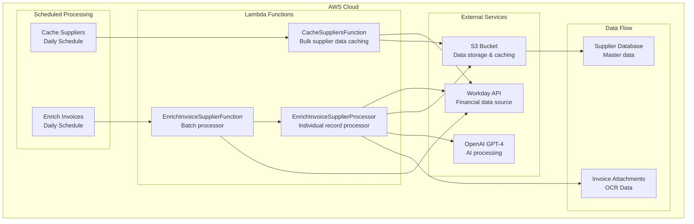
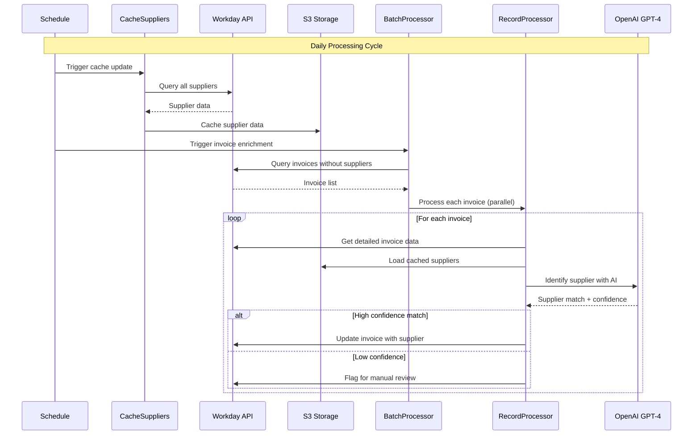

# Finance Agent 🏦

> **AI-Powered Finance Automation for Workday**  
> Event-driven serverless architecture for intelligent invoice processing and supplier management

[](https://www.typescriptlang.org/)
[](https://aws.amazon.com/lambda/)
[](https://nodejs.org/)
[](https://openai.com/)

## 🎯 Overview

The Finance Agent is a sophisticated serverless automation system that leverages AI to intelligently process financial data from Workday. It automatically identifies suppliers for invoices, caches supplier information, and enriches financial records using OpenAI's GPT-4 for natural language understanding.

### Key Features

- 🤖 **AI-Powered Supplier Identification** - Uses GPT-4 to match invoices with suppliers
- 📊 **Intelligent Data Processing** - Processes large datasets with batch optimization
- 🔄 **Event-Driven Architecture** - Scalable serverless design with AWS Lambda
- 💾 **Smart Caching** - Efficient supplier data caching in S3
- 🔍 **OCR Integration** - Processes invoice attachments and metadata
- 📈 **High Performance** - Parallel processing with early exit optimization

## 🏗️ Architecture

### System Overview



### Processing Flow



## 🚀 Quick Start

### Prerequisites

- **Node.js 20+** - Runtime environment
- **AWS CLI** - For deployment and configuration
- **SAM CLI** - For serverless application management
- **Workday API Access** - Financial data source
- **OpenAI API Key** - AI processing

### Installation

```bash
# Clone the repository
git clone <repository-url>
cd finance-agent

# Install dependencies
npm install

# Build the project
npm run build

# Run tests
npm test

# Deploy to AWS
sam build && sam deploy --guided
```

### Environment Configuration

Configure the following parameters in AWS Systems Manager Parameter Store:

```bash
# Workday Configuration
aws ssm put-parameter --name /finance-agent/workday-domain --value "your-workday-domain" --type String
aws ssm put-parameter --name /finance-agent/workday-tenant --value "your-tenant" --type String
aws ssm put-parameter --name /finance-agent/workday-client-id --value "your-client-id" --type String
aws ssm put-parameter --name /finance-agent/workday-client-secret --value "your-client-secret" --type SecureString
aws ssm put-parameter --name /finance-agent/workday-refresh-token --value "your-refresh-token" --type SecureString

# OpenAI Configuration
aws ssm put-parameter --name /finance-agent/openai-api-key --value "sk-..." --type SecureString
```

## 📁 Project Structure

```
src/
├── cache_suppliers.ts              # Supplier data caching
├── enrich_invoice_supplier.ts      # Invoice enrichment processing
├── lib/
│   ├── actions.ts                  # Action factory patterns
│   ├── openai.ts                   # OpenAI API integration
│   ├── s3.ts                       # S3 storage utilities
│   ├── types.ts                    # TypeScript type definitions
│   └── workday.ts                  # Workday API client
├── __tests__/                      # Jest test suite
└── globals.d.ts                   # Global type declarations
```

## 🔧 Core Components

### 1. Cache Suppliers (`cache_suppliers.ts`)

**Purpose**: Bulk caching of supplier master data from Workday

**Key Features**:
- Fetches all suppliers with contact information
- Transforms complex Workday data into simplified format
- Stores in S3 for fast retrieval during processing
- Runs daily to keep data fresh

**Query**:
```sql
SELECT 
  supplier, 
  lastUpdatedDateTime, 
  supplierStatus, 
  allPhoneNumbers, 
  allEmailAddresses, 
  allAddresses 
FROM suppliers1 (dataSourceFilter = defaultFilter)
```

### 2. Enrich Invoice Supplier (`enrich_invoice_supplier.ts`)

**Purpose**: AI-powered supplier identification for invoices

**Architecture**:
- **Batch Handler**: Queries invoices missing supplier information
- **Record Processor**: Processes individual invoices with AI
- **Smart Batching**: Optimizes supplier matching with configurable batch sizes
- **Early Exit**: Stops processing when high-confidence matches are found

**Key Features**:
- Loads cached supplier data from S3
- Uses GPT-4 for intelligent supplier matching
- Processes invoice attachments and OCR data
- Implements confidence-based decision making
- Parallel processing for scalability

### 3. Action Factory (`lib/actions.ts`)

**Purpose**: Standardized handler patterns for different processing types

**Patterns**:
- **`withBulkHandler`**: Single function processes all data
- **`withBatchHandler`**: Distributes work across multiple processors
- **`withRecordHandler`**: Processes individual records

### 4. Workday Integration (`lib/workday.ts`)

**Features**:
- OAuth 2.0 authentication with refresh tokens
- Paginated query execution for large datasets
- Parallel page fetching for performance
- Comprehensive error handling

### 5. AI Processing (`lib/openai.ts`)

**Features**:
- Structured JSON schema responses
- Configurable models (default: GPT-4)
- Optimized token usage
- Error handling and retry logic

## 🔄 Processing Patterns

### Bulk Processing Pattern


**Use Case**: Supplier caching, reporting, bulk updates

### Batch Processing Pattern


**Use Case**: Invoice enrichment, large dataset processing

### Record Processing Pattern


**Use Case**: Individual invoice processing, real-time updates

## 🧠 AI-Powered Features

### Supplier Identification

The system uses GPT-4 to intelligently match invoices with suppliers by analyzing:

- **Invoice Metadata**: Invoice numbers, amounts, dates
- **OCR Data**: Extracted text from invoice attachments
- **Supplier Database**: Cached supplier information
- **Context Clues**: Company names, addresses, contact information

### Confidence-Based Processing

```typescript
interface SupplierIdentificationResult {
  supplierId: string;
  supplierName: string;
  confidence: number;        // 0-1 scale
  reasoning: string;        // AI explanation
}
```

**Decision Logic**:
- **High Confidence (≥0.9)**: Automatic supplier assignment
- **Medium Confidence (0.5-0.9)**: Flag for review
- **Low Confidence (<0.5)**: Manual processing required

## 📊 Performance Optimization

### Batch Processing Configuration

```typescript
const SUPPLIER_BATCH_SIZE = 10000;           // Suppliers per batch
const HIGH_CONFIDENCE_THRESHOLD = 0.9;       // Early exit threshold
const MAX_BATCHES_TO_PROCESS = 50;           // Processing limit
```

### Parallel Processing

- **Supplier Batching**: Processes suppliers in configurable batches
- **Early Exit**: Stops processing when high-confidence matches are found
- **Lambda Invocation**: Parallel processing of individual records
- **S3 Caching**: Reduces API calls to Workday

## 🧪 Testing

### Test Coverage

```bash
# Run all tests
npm test

# Run with coverage
npm run test:coverage

# Watch mode
npm run test:watch
```

**Test Structure**:
- **Unit Tests**: Individual function testing
- **Integration Tests**: API interaction testing
- **Mock Services**: Simulated external dependencies

### Test Files

- `cache_suppliers.test.ts` - Supplier caching tests
- `enrich_invoice_supplier.test.ts` - Invoice processing tests
- `openai.test.ts` - AI integration tests
- `s3.test.ts` - Storage tests
- `workday.test.ts` - Workday API tests

## 🚀 Deployment

### AWS SAM Deployment

```bash
# Build the application
sam build

# Deploy with guided setup
sam deploy --guided

# Deploy with existing configuration
sam deploy
```

### Infrastructure Components

- **Lambda Functions**: Serverless compute
- **S3 Bucket**: Data storage and caching
- **IAM Roles**: Secure access permissions
- **CloudWatch**: Logging and monitoring
- **Parameter Store**: Configuration management

## 🔧 Development

### Available Scripts

```bash
npm run build          # Compile TypeScript
npm run build:watch    # Watch mode compilation
npm run lint           # ESLint checking
npm run lint:fix       # Auto-fix linting issues
npm run clean          # Clean build artifacts
npm test               # Run test suite
npm run test:coverage  # Test with coverage report
```

### Code Quality

- **TypeScript**: Strict type checking
- **ESLint**: Code quality enforcement
- **Jest**: Comprehensive testing
- **AWS Best Practices**: Security and performance

## 📈 Monitoring & Observability

### CloudWatch Integration

- **Function Logs**: Detailed execution logging
- **Metrics**: Performance and error tracking
- **Alarms**: Automated alerting
- **Dashboards**: Visual monitoring

### Debugging

```typescript
import { debug } from '@pga/logger';

debug('Processing invoice:', invoiceData);
debug('Supplier match confidence:', result.confidence);
```

## 🔒 Security

### Authentication & Authorization

- **Workday OAuth**: Secure API access
- **AWS IAM**: Least privilege access
- **Parameter Store**: Encrypted secrets
- **VPC Integration**: Network isolation (optional)

### Data Protection

- **Encryption at Rest**: S3 server-side encryption
- **Encryption in Transit**: HTTPS/TLS
- **Secure Parameters**: AWS Systems Manager
- **Access Logging**: CloudTrail integration

## 🚀 Extending the System

### Adding New Actions

1. **Create Handler**: Copy existing action pattern
2. **Add Lambda Function**: Update `template.yml`
3. **Configure Schedule**: Add trigger if needed
4. **Deploy**: Update infrastructure

### Example: Payment Processing

```typescript
// src/actions/process_payment.ts
export const handler = withBulkHandler(PAYMENT_QUERY)(processPaymentAction);
```

```yaml
# template.yml
ProcessPaymentFunction:
    Type: AWS::Serverless::Function
    Properties:
      Handler: dist/actions/process_payment.handler
      Events:
      Schedule:
        Type: Schedule
          Properties:
          Schedule: rate(1 hour)
```

## 📚 API Reference

### Core Types

```typescript
interface CachedSupplier {
  supplierId: string;
  supplierName: string;
  lastUpdatedDateTime: string;
  supplierStatus: string;
  allPhoneNumbers: string[];
  allEmailAddresses: string[];
  allAddresses: string[];
}

interface SupplierIdentificationResult {
  supplierId: string;
  supplierName: string;
  confidence: number;
  reasoning: string;
}
```

### Configuration

```typescript
interface WorkdayConfig {
  domain: string;
  tenant: string;
  clientId: string;
  clientSecret: string;
  refreshToken: string;
}

interface S3Config {
  bucketName: string;
}
```

## 🤝 Contributing

1. **Fork the repository**
2. **Create a feature branch**
3. **Make your changes**
4. **Add tests for new functionality**
5. **Ensure all tests pass**
6. **Submit a pull request**

## 📄 License

This project is licensed under the MIT License - see the LICENSE file for details.

## 🆘 Support

For questions, issues, or contributions:

- **Issues**: GitHub Issues
- **Documentation**: This README
- **Code**: TypeScript source files
- **Tests**: Jest test suite

---

**Built with ❤️ using TypeScript, AWS Lambda, and OpenAI GPT-4**