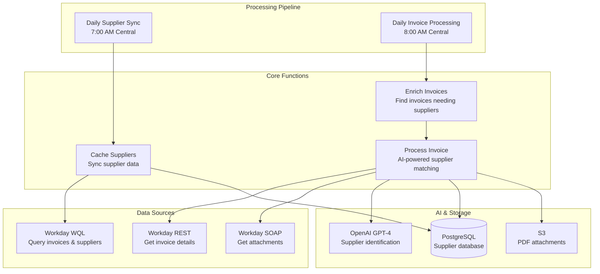

# Finance Agent 🏦

> **AI-Powered Finance Automation for Workday**  
> Serverless system for intelligent invoice processing and supplier management

[](https://www.typescriptlang.org/)
[](https://aws.amazon.com/lambda/)
[](https://nodejs.org/)
[](https://openai.com/)

## 🎯 Overview

The Finance Agent automates financial data processing in Workday by intelligently identifying suppliers for invoices. It uses AI to analyze invoice content, matches suppliers using semantic search, and enriches financial records automatically.

### Key Features

- 🤖 **AI-Powered Supplier Identification** - Automatically matches invoices with suppliers
- 📊 **Intelligent Data Processing** - Processes large datasets efficiently
- 🔄 **Event-Driven Architecture** - Scalable serverless design
- 🔍 **Document Processing** - Handles PDF attachments and OCR data
- 📱 **Real-time Notifications** - Slack alerts for processing status

## 🏗️ Architecture

The system runs on AWS Lambda with scheduled processing and uses multiple Workday APIs for data access.

### System Components



### Workday API Usage

**WQL (Workday Query Language)**
- Queries supplier master data and invoices
- Used for bulk data retrieval and filtering
- Scheduled daily for supplier sync and invoice discovery

**SOAP API**
- Retrieves detailed invoice information with PDF attachments
- Provides structured data exchange for invoice processing
- Enables access to invoice documents and metadata

### Daily Processing

1. **7:00 AM Central - Supplier Sync**: Updates supplier database with latest Workday data
2. **8:00 AM Central - Invoice Processing**: Finds invoices missing suppliers and processes them
3. **AI Analysis**: For each invoice, AI analyzes content and matches suppliers
4. **Notifications**: Slack alerts for processing results and any issues

## 📁 Project Structure

```
src/
├── cache_suppliers.ts              # Daily supplier data sync
├── enrich_invoice_supplier.ts      # Invoice processing with AI
├── query_documents.ts              # Document search endpoint
├── lib/
│   ├── ai.ts                       # AI integration
│   ├── database.ts                 # PostgreSQL database
│   ├── slack.ts                    # Slack notifications
│   ├── workday.ts                  # Workday API client
│   └── types.ts                    # Type definitions
└── __tests__/                      # Test suite
```

## 🔧 System Architecture

### Vector Database
- PostgreSQL with pgvector for semantic supplier search
- Stores supplier embeddings for intelligent matching
- Enables fast similarity search across supplier data
- Incremental sync keeps data current

### PDF Processing
- Downloads invoice PDFs from Workday
- Splits multi-page PDFs into separate images
- Uses vision models to extract text and data
- Generates presigned URLs for document access

### Workday Integration
- **WQL**: Bulk data queries for suppliers and invoices
- **SOAP API**: Detailed invoice information and PDF attachments
- OAuth authentication with refresh tokens
- Handles large datasets with pagination

### AI Processing
- OpenAI GPT-4 for supplier identification
- Structured responses with confidence scoring
- Analyzes invoice content and metadata
- Integrates with vector database for context

## 🧠 AI-Powered Features

### Supplier Identification
AI analyzes invoice content and matches suppliers by examining metadata, OCR data, and company information using semantic search.

### Processing Results
- **High Confidence**: Automatic supplier assignment
- **Ambiguous**: Multiple candidates - flagged for review  
- **Not Found**: No suitable match - requires manual processing
- **Error**: Processing failed - retry or manual intervention

## 🔧 Development

### Prerequisites

- Node.js 20+
- Workday API access
- OpenAI API key

### Local Development

```bash
git clone <repository-url>
cd finance-agent
npm install
npm run build
npm test
```

### Configuration

Set up parameters in AWS Systems Manager Parameter Store for Workday credentials, OpenAI API key, and Slack webhook URL.

## 🧪 Testing

```bash
npm test                    # Run all tests
npm run test:coverage      # Run with coverage
```

Tests cover all core functions including supplier sync, invoice processing, AI integration, and Workday API interactions.

## 🚀 Deployment

Deployment is automated via CircleCI:
- **Development**: Deploys on `development` branch
- **Production**: Deploys on `main` branch

### Infrastructure
- AWS Lambda functions with VPC integration
- Aurora PostgreSQL database
- S3 bucket for PDF attachments
- CloudWatch for logging and monitoring

## 📈 Monitoring

- **CloudWatch**: Function logs and metrics
- **Slack**: Real-time notifications to #notify-finance-agent-dev
- **Error Tracking**: Detailed error context and processing statistics

## 🔒 Security

- Workday OAuth authentication
- AWS IAM with least privilege access
- Encrypted secrets in Parameter Store
- VPC network isolation
- Data encryption at rest and in transit

## 📄 License

TBD