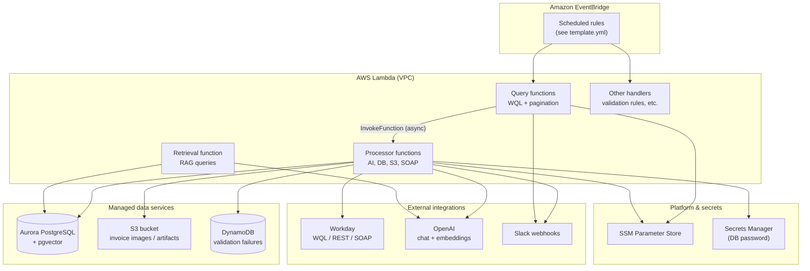
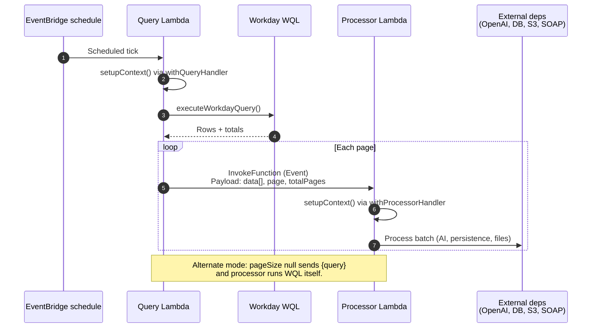
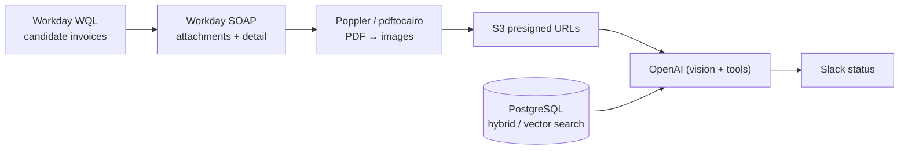

# ADR 0001: Finance Agent — serverless architecture for Workday invoice enrichment

## Status

Accepted

## Date

2026-04-22

## Context

The Finance Agent (`finance-agent`) automates accounts-payable workflows in Workday: it discovers supplier-related invoices, retrieves attachments, uses AI-assisted analysis with retrieval-augmented supplier matching, and notifies operators via Slack. The system must integrate with multiple Workday surfaces (WQL for bulk reads, REST/SOAP for detail and binaries), store embeddings for semantic search, handle PDF-to-image conversion in Lambda, and run on PGA’s AWS estate with shared VPC primitives.

Stakeholders need a durable record of **why** this shape was chosen and **how** major components relate, independent of day-to-day README edits.

> **Note:** This repository follows the organization’s ADR practice ([ADR documentation](https://technology.pgahq.com/engineering/ADRs/adr-documentation)). That page was not reachable from the authoring environment; this document uses a conventional ADR layout (title, status, context, decision, consequences) so it can be aligned with any internal template during review.

## Decision

We implement Finance Agent as **AWS SAM / CloudFormation–deployed Node.js 20 Lambdas** inside an existing VPC (subnet and VPC IDs imported from the `pgagent` stack), with:

1. **Query vs. processor Lambdas** — A thin “query” function runs Workday WQL (and similar), paginates results, and asynchronously invokes a “processor” function per page. Processors own heavy I/O: OpenAI calls, PostgreSQL writes, S3 uploads, SOAP attachment retrieval, and optional direct WQL execution when `pageSize` is `null` (self-contained refresh-style flows). Factories `withQueryHandler` and `withProcessorHandler` in `src/lib/handlers.ts` standardize this contract.

2. **Data plane** — **Aurora PostgreSQL** (cluster + serverless instance) holds application data including **pgvector**-backed documents for RAG. **S3** stores derived invoice imagery with presigned access for models. **DynamoDB** stores invoice validation failure metadata for the enrich path. Secrets: **SSM Parameter Store** for integration config, **Secrets Manager** for the DB password.

3. **Cross-cutting** — **CircleCI** builds and deploys; runtime uses `@pga/lambda-env` and `@pga/logger`. The enrich processor ships a **Poppler** Lambda layer for `pdftocairo`-style PDF rasterization.

4. **Schedules** — EventBridge rules in `template.yml` drive cadence (UTC cron expressions); operational tuning of cron expressions is infrastructure configuration, not application code.

## Architecture (diagrams)

### High-level deployment and data stores

### Query / processor collaboration

### Invoice enrichment data path (conceptual)

## Consequences

### Positive

- **Operational isolation** — Query Lambdas stay short-lived; long work runs in processors with tailored timeouts/memory (for example, higher timeout on supplier cache processors).
- **Horizontal scale** — Each page invokes a separate processor execution, which maps naturally to large Workday datasets without a single oversized Lambda run.
- **Security posture** — No public database; Lambdas and Aurora sit in private subnets with least-privilege IAM, SSM-backed secrets, and generated DB passwords in Secrets Manager.
- **Observable boundaries** — Clear CloudWatch log groups per function; Slack notifications can attribute failures to query vs. processor stages.

### Negative / trade-offs

- **Distributed system complexity** — Async invokes add eventual consistency, duplicate-processing idempotency concerns, and the need to trace across two log streams.
- **Cold start surface** — Many distinct functions and VPC ENI setup can add latency variance versus a single long-running service.
- **Coupling to shared VPC exports** — Stack imports from `pgagent` tie deployment ordering and network design to that parent stack.

### Follow-up decisions (out of scope here)

- Model/provider selection and prompt versioning strategy.
- Exact RAG scoring thresholds and index maintenance windows.
- Disaster recovery and multi-region posture for Aurora and S3.

## References

- `template.yml` — deployed functions, schedules, IAM, Aurora, S3, DynamoDB, Poppler layer.
- `README.md` — narrative architecture and extended Mermaid flows.
- `src/lib/handlers.ts` — `withQueryHandler` / `withProcessorHandler` implementation.
