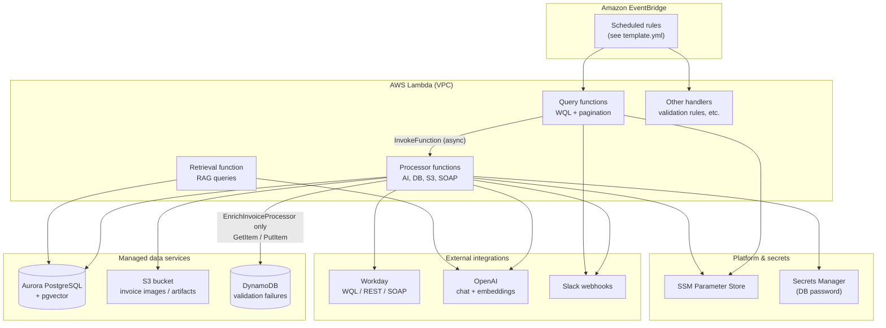
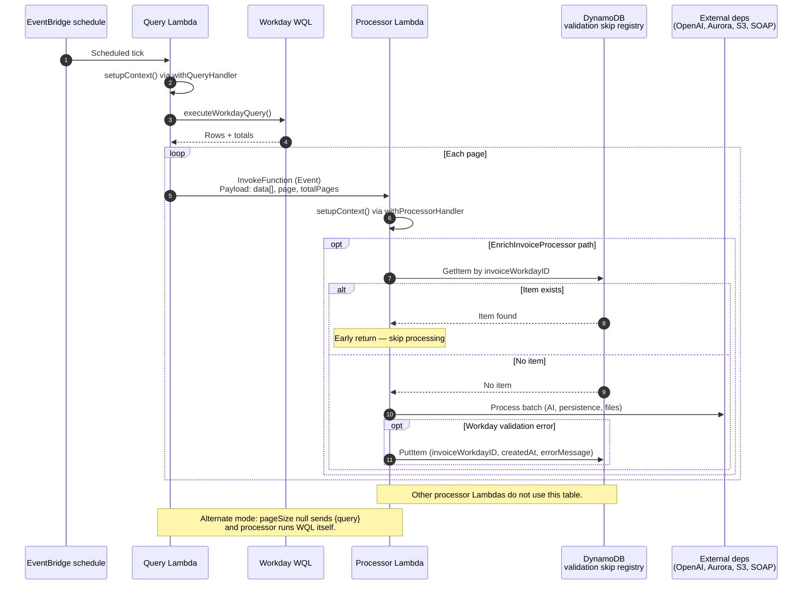
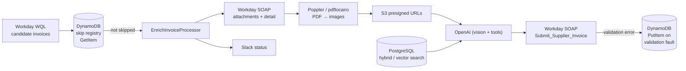
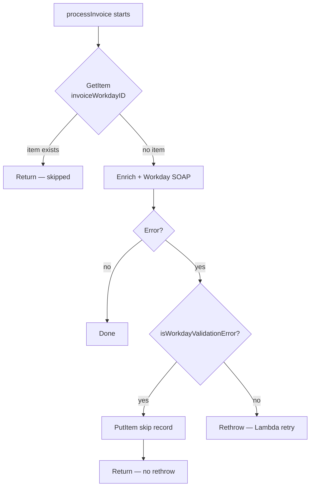
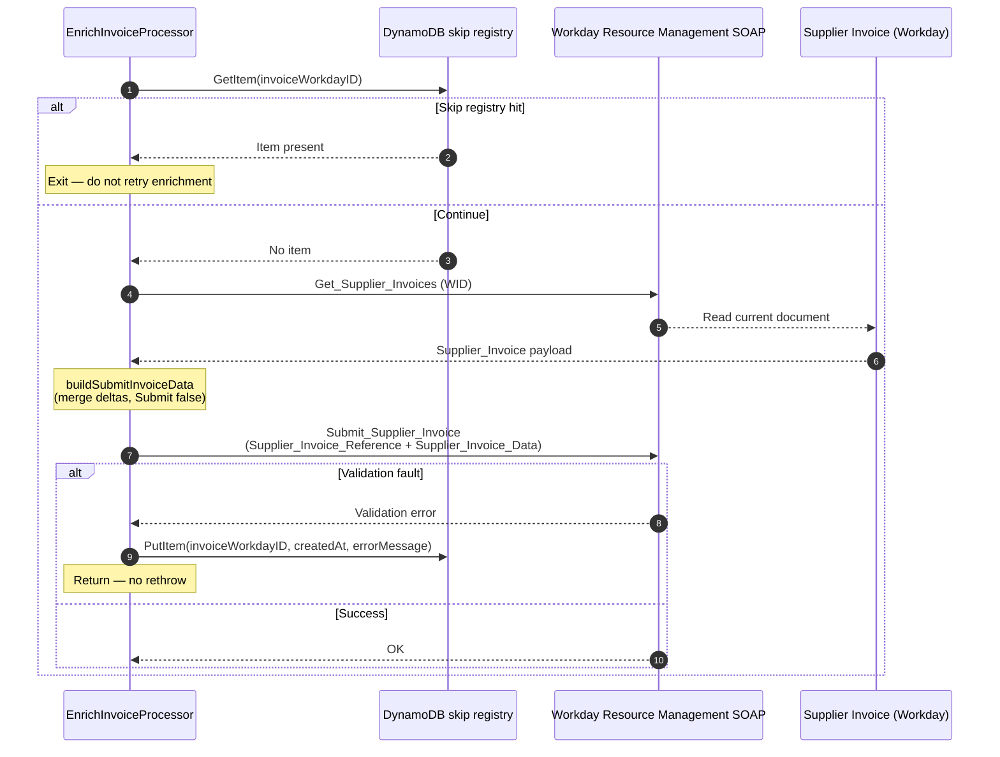
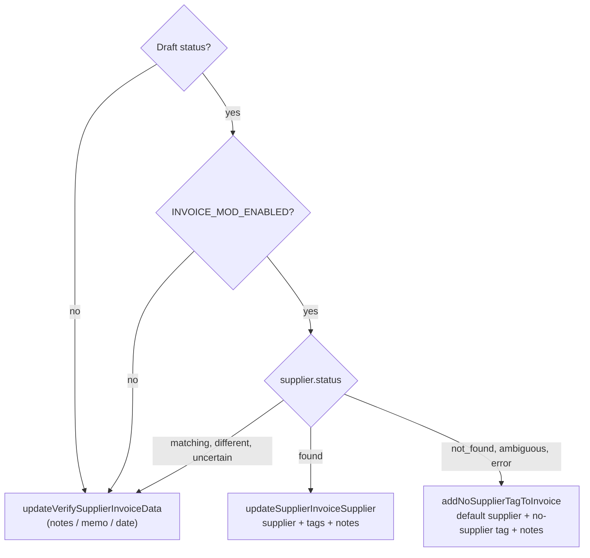

# ADR 0001: Finance Agent — serverless architecture for Workday invoice enrichment

## Status

Accepted

## Date

2026-04-22

## Context

The Finance Agent (`finance-agent`) automates accounts-payable workflows in Workday: it discovers supplier-related invoices, retrieves attachments, uses AI-assisted analysis with retrieval-augmented supplier matching, and notifies operators via Slack. The system must integrate with multiple Workday surfaces (WQL for bulk reads, REST/SOAP for detail and binaries), store embeddings for semantic search, handle PDF-to-image conversion in Lambda, and run on PGA’s AWS estate with shared VPC primitives.

Stakeholders need a durable record of **why** this shape was chosen and **how** major components relate, independent of day-to-day README edits.

> **Note:** This repository follows the organization’s ADR practice ([ADR documentation](https://technology.pgahq.com/engineering/ADRs/adr-documentation)). That page was not reachable from the authoring environment; this document uses a conventional ADR layout (title, status, context, decision, consequences) so it can be aligned with any internal template during review.

## Decision

We implement Finance Agent as **AWS SAM / CloudFormation–deployed Node.js 20 Lambdas** inside an existing VPC (subnet and VPC IDs imported from the `pgagent` stack), with:

1. **Query vs. processor Lambdas** — A thin “query” function runs Workday WQL (and similar), paginates results, and asynchronously invokes a “processor” function per page. Processors own heavy I/O: OpenAI calls, PostgreSQL writes, S3 uploads, SOAP attachment retrieval, and optional direct WQL execution when `pageSize` is `null` (self-contained refresh-style flows). Factories `withQueryHandler` and `withProcessorHandler` in `src/lib/handlers.ts` standardize this contract.

2. **Data plane** — **Aurora PostgreSQL** (cluster + serverless instance) holds application data including **pgvector**-backed documents for RAG. **S3** stores derived invoice imagery with presigned access for models. **DynamoDB** holds a **per-invoice skip registry** for Workday **validation** failures on the enrich path (see below). Secrets: **SSM Parameter Store** for integration config, **Secrets Manager** for the DB password.

3. **Cross-cutting** — **CircleCI** builds and deploys; runtime uses `@pga/lambda-env` and `@pga/logger`. The enrich processor ships a **Poppler** Lambda layer for `pdftocairo`-style PDF rasterization.

4. **Schedules** — EventBridge rules in `template.yml` drive cadence (UTC cron expressions); operational tuning of cron expressions is infrastructure configuration, not application code.

## Architecture (diagrams)

### High-level deployment and data stores

### Query / processor collaboration

### Invoice enrichment data path (conceptual)

### DynamoDB: validation-failure skip registry (enrich path)

**Problem** — Some invoices hit **Workday validation faults** (SOAP `Validation_Fault` shape or message text matching a validation pattern). Retrying the same invoice on every schedule would spam errors and waste capacity without fixing the underlying Workday data.

**Table** — CloudFormation defines `InvoiceValidationFailuresTable` (`template.yml`): partition key **`invoiceWorkdayID`** (string), on-demand billing. Only **`EnrichInvoiceProcessor`** receives `INVOICE_VALIDATION_FAILURES_TABLE_NAME` and IAM for `dynamodb:GetItem` / `dynamodb:PutItem` on that table.

**Write (record failure)** — In `processInvoice`, if any thrown error passes `isWorkdayValidationError`, the processor calls `recordInvoiceValidationFailure`, which **`PutItem`s** an item:

- `invoiceWorkdayID` — Workday invoice WID (same as the table key).
- `createdAt` — ISO timestamp when the failure was recorded.
- `errorMessage` — truncated summary of the fault (for debugging; max ~1000 chars).

The handler **returns without rethrowing**, so Lambda does not retry this invocation as a hard failure for that path.

**Read (avoid retry loop)** — At the start of `processInvoice`, **`GetItem`** by `invoiceWorkdayID`. If an item exists, processing **returns immediately** (no Workday GET, no AI, no submit). The invoice can still appear in WQL results, but the processor becomes a cheap no-op until the DynamoDB row is removed or the invoice drops out of the query scope.

**Scope** — Only **validation-class** Workday errors are recorded. Other errors are rethrown (normal Lambda retry / DLQ behavior applies per function configuration). Clearing a stuck invoice requires **operational removal** of the DynamoDB item (or a future admin tool); that is intentionally out of band so bad data does not loop forever.

### Workday writes: payload, transport, and when they run

Reads use **WQL** (`GET` to `/api/wql/v1/.../data` with a bearer token). **Mutations to supplier invoices** do not use WQL; they use the **Resource Management** SOAP web service (`Resource_Management.wsdl`, endpoint `.../Resource_Management/v44.1`) with **OAuth2 bearer** security (`strong-soap` + `BearerSecurity`), same token source as WQL (`getAccessToken`).

Every invoice update follows the same mechanical pattern in `src/lib/workday.ts`:

1. **Load current state** — `Get_Supplier_Invoices` (SOAP) returns the existing `Supplier_Invoice` document (header, lines, work queue data, etc.).
2. **Build replacement data** — `buildSubmitInvoiceData` merges the current invoice with intended changes. The payload sets **`Submit: false`** so Workday treats the call as an in-place supplier-invoice update path (not “submit this document for approval” in the boolean sense of that field name—see Workday web service docs for exact semantics).
3. **Post the change** — `Submit_Supplier_Invoice` with `Submit_Supplier_Invoice_Request` containing `Supplier_Invoice_Reference` (invoice **WID**) and `Supplier_Invoice_Data` (the merged structure).

**What goes into `Supplier_Invoice_Data` (high level)** — largely a **round-trip** of the current invoice plus deltas:

- **Identity / amounts** — `Company_Reference`, `Currency_Reference`, `Invoice_Number`, `Control_Amount_Total`, optional tax/freight/discount fields, ship-to, on-hold/prepaid flags, currency rate data, etc., copied from the GET response so Workday receives a coherent document.
- **Supplier** — `Supplier_Reference` is set from the AI-resolved **`Supplier_ID`**, or from configured fallbacks (for example `WORKDAY_DEFAULT_SUPPLIER_ID` when tagging “no supplier”).
- **Dates** — `Invoice_Date` is resolved from AI-extracted date when provided, otherwise first day of current UTC month; `Invoice_Received_Date` preserved when present.
- **Lines** — `Invoice_Line_Replacement_Data` is rebuilt from existing lines (with tax data stripped per mapping); optional **fallback worktags** (`FALLBACK_FUND_ID`, `FALLBACK_COST_CENTER_ID`) are merged onto lines that have spend/item references when those env vars are set.
- **Payment terms** — uses existing `Payment_Terms_Reference` or `FALLBACK_PAYMENT_TERMS_ID` when missing on the invoice.
- **Human-visible audit** — `Memo` and/or `Work_Queue_Information_Data` with **work queue notes** (agent text prefixed with `FINANCE AGENT:`) and optional **work queue tags** (WIDs from `WORKDAY_AGENT_MODIFIED_TAG_WID`, `WORKDAY_AGENT_NO_SUPPLIER_TAG_WID`).

**Application entry points** (all ultimately call `client.Submit_Supplier_Invoice`):

| Function | Typical use | Supplier / tags / notes |
| --- | --- | --- |
| `updateSupplierInvoiceSupplier` | High-confidence match | Sets supplier to resolved **Supplier_ID**; adds **agent-modified** tag when `WORKDAY_AGENT_MODIFIED_TAG_WID` is set; merges **notes** and optional **memo** / **invoice date**. |
| `addNoSupplierTagToInvoice` | `not_found`, `ambiguous`, `error` when modifications allowed | Sets supplier reference from **`WORKDAY_DEFAULT_SUPPLIER_ID`**; adds **no-supplier** tag; notes/memo/date as provided. |
| `updateVerifySupplierInvoiceData` | Verification-only outcomes, or when modifications disabled | Keeps supplier from current invoice (unless default path in builder applies); updates **notes/memo/date** and optional agent-modified tag. |

The **enrich invoice** processor (`src/enrich_invoice.ts`) chooses among these based on AI `status` and **`INVOICE_MOD_ENABLED`** (defaults to enabled unless env is `'false'`). **Supplier assignment and work-queue tag changes are only attempted for invoices in `Draft`** (`invoiceStatusAsText === 'Draft'`); non-draft invoices still receive **notes-only** updates via `updateVerifySupplierInvoiceData`. A standalone local script `src/update-invoice-supplier.ts` can call `updateSupplierInvoiceSupplier` for manual fixes.

## Consequences

### Positive

- **Operational isolation** — Query Lambdas stay short-lived; long work runs in processors with tailored timeouts/memory (for example, higher timeout on supplier cache processors).
- **Horizontal scale** — Each page invokes a separate processor execution, which maps naturally to large Workday datasets without a single oversized Lambda run.
- **Security posture** — No public database; Lambdas and Aurora sit in private subnets with least-privilege IAM, SSM-backed secrets, and generated DB passwords in Secrets Manager.
- **Observable boundaries** — Clear CloudWatch log groups per function; Slack notifications can attribute failures to query vs. processor stages.
- **Validation fault circuit breaker** — DynamoDB gives a cheap, idempotent “do not process this invoice again” flag for known-bad Workday payloads without changing WQL or Workday configuration.

### Negative / trade-offs

- **Distributed system complexity** — Async invokes add eventual consistency, duplicate-processing idempotency concerns, and the need to trace across two log streams.
- **Skip registry operations** — Invoices recorded in DynamoDB stay skipped until the item is deleted; there is no automatic TTL in the documented stack, so operators must clear rows deliberately when Workday is fixed.
- **Cold start surface** — Many distinct functions and VPC ENI setup can add latency variance versus a single long-running service.
- **Coupling to shared VPC exports** — Stack imports from `pgagent` tie deployment ordering and network design to that parent stack.

### Follow-up decisions (out of scope here)

- Model/provider selection and prompt versioning strategy.
- Exact RAG scoring thresholds and index maintenance windows.
- Disaster recovery and multi-region posture for Aurora and S3.

## References

- `template.yml` — deployed functions, schedules, IAM, Aurora, S3, DynamoDB, Poppler layer.
- `README.md` — narrative architecture and extended Mermaid flows.
- `src/lib/handlers.ts` — `withQueryHandler` / `withProcessorHandler` implementation.
- `src/lib/invoice_validation_failures.ts` — DynamoDB skip registry (`isWorkdayValidationError`, `recordInvoiceValidationFailure`, `isInvoiceMarkedForSkip`).
- `src/enrich_invoice.ts` — early exit on skip; catch path records validation failures.
